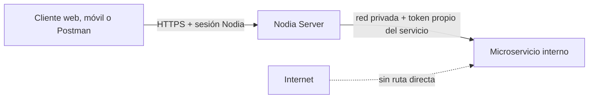

# Guía para agregar un microservicio interno seguro

> Estado: patrón de arquitectura confirmado; checklist de aplicación obligatoria para microservicios nuevos
> Fecha: 2026-09-28
> Decisión: [ADR-008](decisions/ADR-008-internal-microservices-only.md). Gemini es la implementación local de referencia; su despliegue en VPS aún no está verificado.

## Regla de acceso

Solo `nodia-server` consume el microservicio. Los clientes no conocen su URL interna ni su token. CORS, ocultar botones y publicar solo en `localhost` no sustituyen autenticación de servicio. `/health` puede quedar sin token únicamente si devuelve un estado mínimo, sin datos de sesión, dependencias, versiones o secretos. Las rutas de documentación, métricas y administración requieren identidad o permanecen deshabilitadas en producción.

## Pasos para un servicio nuevo

### 1. Definir contrato y amenazas

- Registrar propietario, finalidad, rutas, métodos, DTO de entrada/salida, errores, timeouts y dependencias externas. Clasificar datos y secretos; definir retención y limpieza. Documentar qué endpoint de Nodia Server invoca cada ruta interna.
- Identificar operaciones costosas y administrativas, uso de archivos, URLs aportadas por usuarios, callbacks y estados persistentes. Evitar rutas genéricas como `/execute` o un proxy que acepte un path arbitrario.
- Si hay una decisión costosa de revertir, varias alternativas o cambio de topología, crear ADR con `decisions/ADR-template.md`. No copiar sin revisión los límites de tamaño o concurrencia de Gemini: se calculan para el trabajo del nuevo servicio.

### 2. Aislar la red

- **Nodia Server en host:** publicar el puerto del contenedor solo en `127.0.0.1:<puerto>` y bloquearlo desde fuera del VPS. El proceso del contenedor puede escuchar en `0.0.0.0` dentro de su namespace; lo que importa es la dirección publicada por el host.
- **Ambos en Docker:** no declarar `ports` para el microservicio; conectarlo con Nodia Server mediante una red dedicada y usar su nombre de servicio en la URL interna. Limitar qué otros contenedores pueden unirse a esa red.
- Comprobar firewall, proxy, reglas del proveedor y exposición real desde otra red. Un `docker-compose.yml` correcto por sí solo no demuestra que el puerto sea inaccesible. Si la comunicación cruza hosts, diseñar TLS/autenticación de transporte antes de desplegar.

### 3. Dar identidad propia al servicio

- Crear **un token diferente por microservicio y entorno**, de 32 bytes aleatorios codificados en 64 caracteres hexadecimales. Usar una variable con nombre propio, por ejemplo `REPORTS_SERVICE_TOKEN`. El valor del servicio y el de Nodia Server deben coincidir; nunca reutilizar `GEMINI_SERVICE_TOKEN` ni compartirlo con el frontend.
- Guardar el token fuera de Git, de la imagen y de respuestas HTTP. Restringir acceso al secreto en el host/gestor de secretos y redactar la cabecera en logs, trazas y errores. No incluir valores reales en `.env.example`.
- El microservicio falla al arrancar cuando falta el token o tiene formato inválido. Un middleware/guard comprueba `X-Nodia-Service-Token` **antes de ejecutar cualquier ruta sensible**, limita la longitud recibida, compara en tiempo constante y responde `401` sin revelar detalles. Si la configuración desaparece en ejecución, responde `503` y no permite continuar.
- Planificar rotación coordinada y revocación: la implementación actual de Gemini admite un solo token y una rotación puede interrumpir brevemente llamadas. Si se requiere rotación sin corte, diseñar un período de dos tokens con vencimiento y pruebas antes de copiarlo al nuevo servicio.

### 4. Integrar desde Nodia Server

- Crear un cliente/adaptador específico para el servicio, con URL interna y token tomados de configuración del servidor. Añadir la cabecera en **todas** las llamadas, incluidas consultas de estado, modelos, administración y reintentos. No pasar el token por query string, cuerpo visible, cookie del navegador ni respuesta al cliente.
- Definir timeout y presupuesto completo de operación, clasificación de errores, reintentos solo si son seguros e idempotentes, y límite de concurrencia. No registrar cuerpo de petición/respuesta cuando contenga datos sensibles. Validar la respuesta del microservicio antes de persistirla o enviarla al cliente.
- Exponer en Nodia Server rutas explícitas para la función de negocio. Aplicar su guard de sesión y permisos por acción/objeto; comprobar ámbito de negocio, propiedad y rol activo antes de llamar al servicio. Una acción administrativa requiere permiso administrativo distinto. El token interno autentica a Nodia Server, **no** autoriza por sí solo al usuario final.
- El frontend usa la API autenticada de Nodia Server. Una integración externa como Postman usa esa misma API; no recibe URL ni token del microservicio.

### 5. Controlar entradas, recursos y datos

- Validar DTO, longitudes, tipos y rangos en NestJS y de nuevo en el microservicio. Para archivos, limitar cuerpo y número de partes en proxy, NestJS y servicio; comprobar tipo real, no solo extensión/MIME declarado; usar nombres temporales aleatorios y limpieza ante fallo/cancelación. Para URLs externas, usar destinos permitidos y bloquear SSRF/redirecciones inesperadas.
- Acotar memoria, CPU, tiempo, simultaneidad y tamaño de respuestas. Añadir cuotas por usuario/organización y límite global para trabajos costosos; definir idempotencia y comportamiento ante caída del proveedor externo.
- Aplicar privilegios mínimos a contenedor, volumen, base de datos y credenciales externas. Mantener secretos y datos persistentes fuera de la imagen; proteger backups. Revisar logs para que no contengan tokens, cookies, claves, archivos ni respuestas crudas.

### 6. Probar y desplegar

Antes de exponer la capacidad por Nodia Server, dejar evidencia de la siguiente matriz:

| Prueba | Resultado exigido |
|---|---|
| Microservicio sin token configurado | Arranque fallido; ruta sensible no funciona. |
| Llamada sin token, erróneo o excesivamente largo | `401`; no se ejecuta la operación. |
| Llamada con token correcto desde Nodia Server | Respuesta prevista dentro del timeout. |
| Usuario Nodia sin sesión, acción o ámbito del objeto | Denegado en Nodia Server antes de consumir el microservicio. |
| Entrada inválida, archivo grande o proveedor externo caído | Rechazo acotado; sin datos sensibles en respuesta/log ni temporales abandonados. |
| Puerto/rutas desde Internet y desde otro contenedor no autorizado | No alcanzables; `/docs` y administración no quedan públicos. |
| Token revocado/rotado y reinicio | Token anterior deja de funcionar; servicio recupera operación con el nuevo. |

Añadir pruebas de valor en el código correspondiente: en Nodia Server, pruebas unitarias de casos de uso según `nodia-server/AGENTS.md`; en el microservicio, pruebas de autenticación, límites y casos de fallo. Registrar comandos, resultados, versión y fecha. Preparar rollback sin desactivar autenticación ni abrir el puerto. Revisar escaneo de secretos, dependencias e imagen antes del despliegue y comprobar la superficie real desde fuera del VPS.

## Referencia concreta de Gemini y límites actuales

- FastAPI: [`service_auth.py`](../../nodia-gemini-microservice/service_auth.py) valida el token y [`main.py`](../../nodia-gemini-microservice/main.py) instala el middleware. El token se configura como `GEMINI_SERVICE_TOKEN`.
- Nodia Server: [`gemini.service.ts`](../../nodia-server/src/common/ai/gemini.service.ts) añade la cabecera; [`action-permission.guard.ts`](../../nodia-server/src/authorization/action-permission.guard.ts) protege acciones de usuario. [`ADR-007`](decisions/ADR-007-gemini-internal-access.md) registra las decisiones específicas.
- Operación: [`docker-compose.yml`](../../nodia-gemini-microservice/docker-compose.yml) publica solo en loopback para la topología con NestJS en host. El [runbook Gemini](../mvp/18-security-deployment-runbook.md) contiene su secuencia de despliegue y reversión.
- **Pendiente en Gemini:** verificación externa del VPS, rotación ensayada, autorización por ámbito de negocio, login gráfico administrativo y pruebas integradas. La guía no convierte esos pendientes en controles implementados.
