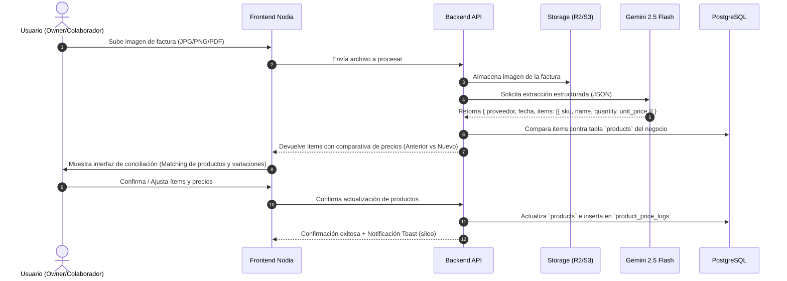

# PRD — Módulo Businesses (Nodia)

> Estado: borrador preliminar para contraste con base de datos
> Fecha de creación: 2026-09-15
> Módulo: `businesses`

---

## 1. Resumen Ejecutivo

El módulo **Businesses** introduce capacidades de gestión comercial multi-negocio dentro de Nodia. Permite a cualquier usuario registrado en la plataforma crear uno o más negocios propios (actuando como **Owner**), invitar a otros usuarios existentes de Nodia como **Colaboradores** con permisos granulares específicos del negocio, y administrar de manera centralizada el catálogo de productos y su estructura de costos.

El núcleo operativo del módulo resuelve el desafío crítico de actualización de precios en inventarios con alta rotación: permite la carga manual, masiva vía CSV, o **inteligente mediante imágenes de facturas de proveedores** (usando visión multimodal por IA), detectando automáticamente variaciones de precios entre compras y optimizando los tiempos administrativos del negocio.

---

## 2. Actores y Modelo de Acceso

### 2.1 Owner (Dueño del Negocio)
* **Definición:** Usuario registrado en Nodia que crea la entidad negocio (`businesses.owner_id = user.id`).
* **Privilegios:**
  * Control total e irrestricto sobre su negocio.
  * Modificación de datos principales (nombre, logo/avatar, estado activo/inactivo).
  * Invitación y administración de colaboradores (asignación y remoción de permisos específicos).
  * Gestión completa de productos, facturas, analítica y exportaciones.
  * Inactivación lógica del negocio.

### 2.2 Colaborador (Collaborator)
* **Definición:** Usuario registrado en Nodia que es invitado formalmente a participar en un negocio específico.
* **Privilegios:**
  * No tiene permisos globales ni por rol estático; sus capacidades dependen exclusivamente del subconjunto de **Business Actions** que el Owner le haya otorgado para ese negocio particular.
  * Puede tener permisos de solo visualización (`products:view`, `analytics:view`), de operación (`products:edit`, `invoices:upload`), o de administración delegada (`collaborators:manage`).
  * No puede eliminar el negocio ni revocar los accesos del Owner.

### 2.3 Super Admin (Plataforma Nodia)
* **Definición:** Usuario con rol global de administración de Nodia.
* **Privilegios en este módulo:**
  * Gobierna el catálogo maestro de **Business Actions** desde `Ajustes Generales > Actions` (define qué capacidades pueden existir para los negocios).
  * No interfiere en la operativa privada de los negocios salvo requerimientos de soporte técnico o auditoría.

---

### 2.4 Proveedores (Providers)
* **Definición:** Entidad comercial que emite facturas y suministra productos a un negocio específico (`providers.business_id = business.id`).
* **Reglas de Despacho (Delivery):**
  * Cada proveedor define un `delivery_cost` base (por defecto `0`).
  * Indicador booleano `include_delivery_in_cost`: determina si el costo de despacho debe distribuirse y sumarse al costo final del producto antes de calcular el margen de ganancia para la venta al público.

---

## 3. Alcance Funcional

### 3.1 Gestión de Proveedores (`/businesses/:id/providers`)
* Catálogo de proveedores por negocio.
* Configuración de costos de despacho predeterminados y regla de inclusión de delivery en el costo unitario.
* Mapeo de plantilla de factura por proveedor (`invoice_fields`).

### 3.2 Mantenedor de Negocios (`/businesses`)
* **Listado visual en Grid de Cards:**
  * Cada tarjeta representa un negocio (diferenciando visualmente si el usuario es Owner o Colaborador).
  * Datos visibles: Nombre del negocio, rol del usuario (Owner vs Colaborador), cantidad de productos, estado (Activo/Inactivo).
  * Menú contextual de opciones (`...`):
    * *Editar negocio* (modal para nombre, descripción o datos generales).
    * *Gestionar colaboradores* (modal para listar, invitar y asignar permisos).
    * *Entrar al negocio* (acceso al detalle).
* **Alta de Negocio:**
  * Botón CTA destacado *"Nuevo Negocio"*.
  * Modal simple para ingresar el nombre inicial del negocio. El creador se establece automáticamente como Owner.

### 3.3 Detalle del Negocio (`/businesses/:id`)
* **Cabecera (Header):**
  * Título del negocio editable in-situ (inline edit o modal rápido).
  * Switch / botón para inactivar/activar el negocio (con confirmación de seguridad).
  * Badge identificador de rol (`Owner` o `Colaborador`).
* **Sección de Analítica Comercial:**
  * Métricas rápidas: Total de productos activos, valor estimado del inventario (costo total), productos con variación de precio reciente (subidas/bajadas detectadas).
  * Gráfico o resumen de las últimas facturas procesadas.
* **Sección de Gestión de Productos (Core):**
  * Tabla paginada server-side con búsqueda y filtros (por categoría, **proveedor**, estado o rango de precio).
  * Columnas: SKU/Código, Nombre del producto, Costo actual (con o sin delivery prorrateado), Precio anterior, % Variación, Precio de venta sugerido/actual, **Proveedor**, Stock/Unidad, Acciones.
  * Trazabilidad: Cada modificación sobre un producto genera una entrada en `product_logs` preservando el estado anterior para comparar el histórico de precios.
  * Métodos de incorporación y actualización de productos:
    1. **Individual:** Modal de creación / edición manual de producto.
    2. **Masivo por CSV:** Importador con mapeo de columnas, validación previa y preview antes de aplicar.
    3. **Inteligente por Factura (AI/OCR):** Subida de foto/PDF de factura para extracción automática de ítems y conciliación de precios basada en la plantilla del proveedor (`invoice_fields`).
  * **Exportación a CSV:**
    * Descarga del catálogo actual de productos filtrado por proveedor u otros criterios.
    * Descarga de la extracción de ítems de una factura procesada.

---

## 4. Flujo de Facturas y Conciliación de Precios

1. **Carga del documento:** El usuario sube una imagen legible de la factura.
2. **Almacenamiento seguro:** Se guarda el archivo en el bucket de almacenamiento (Cloudflare R2 / S3) para referencia y auditoría futura.
3. **Extracción Multimodal (Gemini):** Se envía la imagen al modelo de IA con un esquema JSON estricto para extraer proveedor, número de comprobante, fecha e ítems desglosados (código, descripción, cantidad, costo unitario).
4. **Matching & Conciliación en UI:**
   * El sistema busca coincidencias con los productos existentes del negocio (por SKU o coincidencia fonética/texto de nombre).
   * La UI presenta una tabla de revisión:
     * Producto existente detectado: Muestra el precio de costo registrado vs el nuevo precio en la factura, con un indicador visual de variación (ej. `+15% 🔺` o `-5% 🔻`).
     * Producto nuevo: Opción de marcar para alta directa en el catálogo.
5. **Confirmación y Registro:** El usuario valida los datos con un clic. El sistema actualiza los precios vigentes y guarda un log histórico de precios para alimentar la analítica.

---

## 5. Reglas de Negocio Críticas

1. **Aislamiento Multi-Tenant Estricto:** Un usuario jamás puede ver, editar ni listar productos o colaboradores de un negocio en el que no sea Owner ni Colaborador activo. Cada consulta en backend debe filtrar forzosamente por `business_id` validando la membresía del usuario autenticado.
2. **Colaboradores Preexistentes:** Solo se pueden invitar usuarios que ya posean una cuenta activa en Nodia (verificación por correo electrónico contra la tabla `users`).
3. **Inmutabilidad del Owner:** Un colaborador no puede expulsar al Owner ni removerle permisos. El Owner es único por negocio.
4. **Desacoplamiento de Acciones:** Las acciones del negocio son específicas (`business_actions`) y no deben saturar el catálogo global de acciones del sistema (`actions`).
5. **Historial de Precios:** Cada vez que un producto cambia de costo (manual, CSV o factura), se debe registrar una entrada en `product_price_logs` con la fecha, el usuario responsable y el origen del cambio para trazabilidad y analítica.
