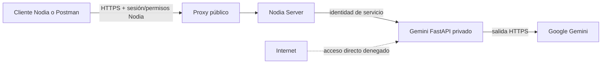
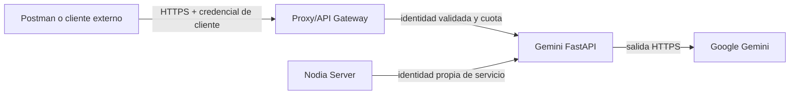

# Plan de seguridad — Nodia API y microservicio Gemini

> Estado: en revisión (plan de trabajo, no aprobado)
> Fecha: 2026-09-28
> Alcance: `nodia-server`, `nodia-gemini-microservice` y los límites de confianza con el cliente, PostgreSQL, Redis, R2 y el VPS.

## Objetivo y criterio de trabajo

Reducir riesgos comprobables antes del primer despliegue público y mantener una verificación repetible después. Ningún plan puede garantizar ausencia total de vulnerabilidades: la salida de cada etapa exige evidencia de controles, pruebas negativas y riesgos residuales documentados. No se presupone que el VPS o el login remoto ya estén desplegados.

Las decisiones de producto aprobadas y los ADR vigentes conservan prioridad. La ampliación de IA, `ADR-005` y `ADR-006` continúan en revisión/propuesta. No se habilita fallback automático entre proveedores o modos de Gemini. El acceso interno exclusivo y el token de servicio inicial quedaron elegidos en [ADR-007](../architecture/decisions/ADR-007-gemini-internal-access.md); la custodia/rotación de claves y el acceso gráfico remoto aún requieren verificación operativa y diseño.

## Dos vistas de acceso al microservicio

**Decisión confirmada por el usuario el 2026-09-28 y registrada en ADR-007:** por ahora, solo Nodia Server debe consumir directamente Gemini. La segunda vista describe una ampliación posible para clientes externos como Postman; no está solicitada para implementar ahora. El token de servicio inicial ya está implementado y falta probarlo en staging.

### Vista A — Uso interno exclusivo (objetivo actual)

- Único ingreso público: NestJS detrás de HTTPS. NestJS comprueba sesión, permisos por acción, ámbito de la factura, cuotas y tamaño antes de llamar a Gemini. Un operador puede probar **la API de Nodia** con Postman si tiene identidad y permiso; Postman no llega directamente a FastAPI.
- Si NestJS corre en el host, FastAPI conserva bind solo a `127.0.0.1` con firewall y una identidad de servicio comprobada por FastAPI. Si ambos corren en contenedores, compartir una red Docker dedicada, quitar `ports` de FastAPI y usar el nombre de servicio; conservar salida controlada hacia Google. Evitar publicar el puerto en `0.0.0.0`.
- FastAPI deniega rutas de análisis, estado de sesión y administración sin la identidad de Nodia Server; claves y cookies no salen al cliente. CORS no sirve como autenticación y puede retirarse del microservicio si ningún navegador lo llama.
- Prueba de salida: desde Internet, `:8000` y `/docs` son inaccesibles; desde el host o contenedor no autorizado, FastAPI devuelve 401/403; desde Nodia Server autorizado, el análisis funciona; un usuario Nodia sin permiso recibe 403 antes de consumir Gemini.

### Vista B — Consumo directo externo (opción futura)

- Requiere contrato y clientes propios: credenciales individuales revocables (por ejemplo, tokens con scopes o API keys por cliente), autorización por ruta, auditoría, cuotas por cliente, límites de archivos, control de costos y versiones del API. TLS, gateway y firewall son obligatorios; CORS solo regula navegadores, no impide llamadas de Postman.
- Las rutas de control de sesión Google, login, cookies, navegador remoto y diagnósticos internos permanecen privadas. No se debe reutilizar una única credencial compartida por todos los clientes ni entregar la identidad de Nodia Server a Postman.
- Puede implementarse más tarde sin publicar FastAPI directamente: exponer endpoints bien delimitados en Nodia Server para clientes externos. Es la evolución preferida si el objetivo es integrarse con Postman u otros sistemas y conservar una sola frontera pública de autorización.
- Prueba de salida: cliente sin credencial, con scope insuficiente o cuota agotada es rechazado; credencial revocada deja de funcionar; ninguna ruta administrativa ni secreto se vuelve pública. Su coste operativo y riesgo adicional requieren nuevo ADR y revisión del modelo de amenazas antes de habilitarlo.

## Línea base observada el 2026-09-28

### Confirmado en el código

- NestJS tiene guard global de autenticación/sesión, rate limit por IP y usuario, validación global de DTO y CORS con orígenes concretos. El ajuste real de proxy, Redis y cuotas en el VPS está pendiente.
- Las rutas `ai-provider`, `ai-api-key` y `ai-provider-event` requieren sesión por el guard global, pero sus controladores y casos de uso no comprueban permisos de administración por acción. La autorización de interfaz no protege la API.
- FastAPI no comprueba identidad en `/analyze-invoice`, `/generate`, `/auth/login`, `/auth/refresh`, `/refresh-session`, `/models` ni `/auth/status`. Su CORS acepta cualquier origen. El `docker-compose.yml` actual publica el puerto solo en `127.0.0.1`, lo que reduce exposición desde Internet **solo si** se usa esa configuración y el host está bien protegido; cualquier proceso local podría llamar las rutas.
- En `ai-key-crypto.helper.ts`, `AI_SECRET_MASTER_KEY` tiene un valor por defecto fijo; la huella HMAC usa una clave fija y `decryptSecret` admite texto sin cifrar. Es necesario inventariar las filas existentes antes de cambiar el formato o la clave para no perder acceso a credenciales.
- El servidor recibe archivos de facturas con `FileInterceptor` sin límite de tamaño explícito; valida el MIME declarado por el cliente. FastAPI valida extensión de nombre, copia todo el archivo y usa un nombre temporal derivado del nombre enviado. La ruta de análisis tiene un timeout de 140 s en NestJS, pero no un presupuesto completo de tamaño, tiempo y concurrencia entre servicios.
- FastAPI devuelve `str(e)` en algunas respuestas HTTP y registra contenido de la respuesta cruda de Gemini ante fallos de parseo; puede exponer datos de facturas. Swagger de NestJS y OpenAPI de FastAPI están habilitados en el código sin política de exposición por entorno.
- La imagen Playwright ejecuta como `root` por defecto; el `Dockerfile` no define otro usuario. `.dockerignore` excluye `.env`, perfil, sesión y archivos temporales del contexto de build, lo que evita copiarlos por `COPY . .` en la configuración actual.

### Inferencias y pendientes de comprobación

- Si el microservicio se publica por error, sus rutas sin autenticación permiten consumir Gemini y accionar la sesión. Si el host u otro contenedor se compromete, el bind a loopback no basta como límite de confianza.
- No se ha demostrado exposición pública actual ni filtración de secretos reales. Verificar historial Git, imágenes, logs, backups y permisos del VPS antes de afirmar compromiso o exigir rotación por incidente.
- `docs/mvp/10-stack-devops.md` mantiene pendientes el diseño operativo del VPS, PostgreSQL/Redis gestionados y la entrega/rollback. La prueba de login remoto de Gemini sigue pendiente.

## Etapa 0 — Inventario, modelo de amenazas y contención previa al VPS

**Prioridad:** inmediata. **Dependencia:** ninguna.

1. Dibujar flujos de datos y confianza: navegador → NestJS → FastAPI → Google; NestJS → PostgreSQL/Redis/R2; operador → login gráfico. Clasificar cookies Google, API keys, tokens, facturas, respuestas de IA y logs; definir quién puede acceder y cuánto se retienen.
2. Enumerar rutas públicas y privadas, identidades, permisos, puertos, volúmenes, egress, cuentas de servicio y secretos de cada entorno. Revisar historial Git e imágenes mediante herramientas de detección de secretos sin imprimir valores.
3. Confirmar en staging que FastAPI, Redis, PostgreSQL, Swagger/OpenAPI y el visor gráfico no son accesibles desde Internet salvo el ingreso deliberado. Cerrar cualquier publicación accidental antes de cargar credenciales reales.
4. Crear registro de riesgos con severidad, responsable, prueba de cierre y decisión de aceptar o remediar. Si aparecen credenciales expuestas, revocarlas/rotarlas y tratar los registros afectados como incidente.

**Salida:** diagrama de confianza, inventario de endpoints/secretos y prueba de puertos desde fuera del VPS; bloqueo de despliegue público ante exposición confirmada.

## Etapa 1 — Cerrar accesos críticos y custodiar secretos

**Prioridad:** bloqueante para producción. **Dependencia:** etapa 0.

1. Definir en ADR una identidad propia **NestJS → FastAPI**: credencial de servicio de alta entropía con rotación y validación en cada ruta sensible, o mTLS si la operación lo justifica. Usar red interna/loopback y firewall como segunda barrera. `/health` debe ser mínimo; separar `liveness` de información de sesión y cuotas.
2. Eliminar o aislar `/generate` y `/refresh-session` si no forman parte del contrato de Nodia. Proteger especialmente login/refresh y la futura consola remota con autorización administrativa en NestJS, sesión breve, un operador a la vez, cierre por tiempo y auditoría. Nunca publicar noVNC directamente.
3. Quitar la clave maestra por defecto y hacer fallar el arranque productivo si falta una clave aleatoria válida. Versionar el formato del cifrado, separar material de cifrado y de huella, y migrar filas antiguas con plan de respaldo/rollback. Probar lectura antes/después de rotación; no registrar secretos ni aceptarlos como texto claro por compatibilidad indefinida.
4. Guardar clave maestra, API keys, cookies y credenciales de infraestructura fuera del repositorio y la imagen; permisos mínimos de archivos/volúmenes, acceso restringido a backups y procedimiento de rotación/revocación. Revisar `browser_profile`, `session_state` y `.env` tanto en Windows local como en Linux VPS.
5. Desactivar documentación interactiva en producción o restringirla a un canal administrativo autenticado. Quitar CORS amplio en FastAPI; si solo NestJS llama a FastAPI, no se necesita CORS de navegador.

**Salida:** peticiones sin identidad o con identidad incorrecta reciben 401/403 en cada ruta sensible; el backend autorizado sigue operando; arranque productivo sin clave maestra falla; ninguna clave/cookie aparece en respuesta, log o imagen.

## Etapa 2 — Autorización de negocio y aislamiento de datos en NestJS

**Prioridad:** bloqueante para producción. **Dependencia:** etapas 0 y 1.

1. Crear una matriz ruta → acción → ámbito para IA, facturas, archivos, usuarios, roles y configuración. Aplicar autorización en servidor con denegación por defecto a `ai-provider`, `ai-api-key`, `ai-provider-event`, sincronización de modelos, análisis y acceso gráfico. Validar permisos activos al ejecutar, con invalidación de caché al cambiar roles.
2. Verificar autorización por objeto y relación: `business_id`, `provider_id`, factura, key y URL firmada de R2 deben pertenecer al ámbito del usuario. Un ID válido de otro negocio debe devolver 403/404 sin filtrar datos. Restringir campos sensibles de salida y entradas de DTO para evitar asignación masiva.
3. Revisar todos los `@Public()`, refresh/logout, cookies, origen y CSRF en operaciones basadas en cookie. Mantener `SameSite`/`Secure` acordes al dominio real y revisar revocación, expiración y sesiones concurrentes en staging.
4. Separar eventos internos de auditoría de cualquier `POST` administrable por clientes: los eventos de seguridad deben generarse por el servidor, con actor y contexto verificados.

**Salida:** matriz aplicada y pruebas negativas de usuario sin permiso, ID ajeno, rol revocado y sesión caducada. En NestJS, pruebas unitarias de valor solo en `use-case/*.use-case.spec.ts`, según `AGENTS.md`.

## Etapa 3 — Entradas, archivos, IA y agotamiento de recursos

**Prioridad:** bloqueante para producción. **Dependencia:** etapas 1 y 2.

1. Limitar tamaño de request y archivo en proxy, Multer y FastAPI; aceptar un archivo y número acotado de partes. Validar tipo real por firma/contenido y estructura de PDF/imagen, rechazar formatos ambiguos, y guardar con nombre aleatorio en directorio privado. Limitar páginas, dimensiones y tiempo de procesamiento; limpiar temporales también ante cancelación/crash.
2. Validar `provider_fields`, `provider_tax`, `model`, longitud del prompt y esquema/tamaño de la respuesta externa. Tratar facturas y respuestas de Gemini como datos no confiables: nunca usar instrucciones contenidas en ellas para invocar herramientas, cambiar permisos o alterar configuración. Revisar el parseo antes de persistir importes e ítems.
3. Poner presupuestos por usuario y globales para análisis costosos: concurrencia, cola acotada, timeout total, cancelación, cuotas y rechazo temprano. Definir idempotencia para reintentos de la misma factura y clasificación de errores para no duplicar cargos ni guardar datos parciales.
4. Restringir egress del contenedor a destinos necesarios y revisar riesgos de redirección/SSRF si se introducen URLs configurables. Las credenciales del microservicio no deben poder leerse desde un flujo de análisis.

**Salida:** pruebas con archivo grande, tipo falseado, PDF corrupto, nombres maliciosos, campos excesivos, respuesta de IA inválida, prompt adversarial, concurrencia y caída del proveedor; uso de memoria/CPU estable y errores sin datos sensibles.

## Etapa 4 — VPS, contenedores y cadena de suministro

**Prioridad:** bloqueante para producción. **Dependencia:** etapas 1 a 3.

1. Definir topología del VPS en `10-stack-devops.md` y ADR si corresponde: único ingreso HTTPS al API, red interna entre servicios, firewall de entrada/salida, SSH con claves y privilegios mínimos, actualizaciones, sincronización horaria y política de parches. Configurar `TRUST_PROXY` solo para proxies reales y verificar Redis/rate limit distribuido.
2. Ejecutar el contenedor Playwright con usuario sin privilegios y sandbox compatible, validado con login real; reducir capabilities, montar perfil/sesión con permisos mínimos y solo los volúmenes necesarios. Probar reinicio y recuperación sin exponer navegador ni sesión.
3. Usar credenciales distintas y permisos mínimos para PostgreSQL, Redis y R2; TLS hacia servicios gestionados, bucket privado, URLs firmadas cortas y copias cifradas con restauración ensayada. Separar desarrollo/staging/producción.
4. Fijar versiones e integridad de dependencias e imagen base; añadir escaneo de secretos, dependencias, código e imagen al CI, con revisión de hallazgos antes de desplegar. Desplegar artefactos revisados, conservar rollback y evitar secretos de larga vida en el pipeline.

**Salida:** prueba desde red externa de superficie publicada, revisión de permisos efectivos de contenedores y servicios, escaneos sin hallazgos críticos abiertos, despliegue/rollback y restauración demostrados.

## Etapa 5 — Verificación integral y operación continua

**Prioridad:** puerta de salida y rutina posterior. **Dependencia:** etapas 0 a 4.

1. Usar [OWASP ASVS 5.0](https://owasp.org/projects/asvs?tab=main) y [OWASP API Top 10](https://api-security.owasp.org/editions/2023/en/0x11-t10/) como checklist de verificación trazable; registrar evidencia y excepciones. Hacer revisión manual de flujos críticos y una prueba de seguridad autorizada en staging.
2. Correlacionar solicitudes NestJS/FastAPI con IDs; registrar actor, acción, resultado, duración y causa técnica sanitizada. Redactar cookies, tokens, keys, contenido de factura, prompts y respuestas crudas; alertar sobre 401/403/429 anómalos, volumen de análisis, intentos de login remoto y errores de descifrado.
3. Crear runbooks de incidente: revocar sesión Google, rotar keys/JWT/clave maestra, aislar microservicio, restaurar perfil o backups, diagnosticar Redis/proxy y volver a desplegar. Revisar accesos y dependencias periódicamente.
4. Antes de producción ejecutar una factura sintética de punta a punta, expiración/renovación de sesión, caída de Gemini, reinicio de contenedor, fallo de Redis, rol revocado y recuperación de backup. Documentar riesgos residuales y aprobación operativa de lanzamiento.

**Salida:** reporte de verificación fechado, alertas probadas, runbooks utilizables y decisión explícita de lanzamiento. Los documentos en revisión no se marcan aprobados automáticamente.

## Avance de implementación — 2026-09-28

| Etapa | Estado | Evidencia y pendiente |
|---|---|---|
| 0 | Parcial | Inventario de código y puertos locales; falta comprobación externa del VPS. |
| 1 | Parcial | Token entre servicios, CORS retirado, llamada directa desde el cliente eliminada, login local administrado por NestJS solo en desarrollo, clave maestra fija eliminada y migración preparada; faltan despliegue, rotación y visor gráfico privado del VPS. |
| 2 | Parcial | Guard de acciones para administración IA y análisis; falta matriz completa y definición de ámbitos de negocios/facturas para usuarios no administradores. |
| 3 | Parcial | Tamaño, firma y concurrencia limitados; faltan análisis profundo de PDF/imagen, cuotas específicas por usuario e idempotencia. |
| 4 | Pendiente | No se modificó ni verificó el VPS, el proxy, TLS o los permisos de contenedores y volúmenes. |
| 5 | Parcial | Build y pruebas locales pasan en los tres servicios; lint de servidor y de archivos cliente modificados pasa. El lint completo del cliente aún tiene 17 errores existentes en otros archivos. Existe [runbook operativo](18-security-deployment-runbook.md); faltan ejercicio integrado y prueba de acceso desde Internet en staging. |

## Orden de ejecución recomendado

`0 → 1 → 2 → 3 → 4 → 5`. Puede prepararse la matriz de permisos y el CI mientras se define la identidad entre servicios, pero **no** publicar la API ni el acceso gráfico antes de cerrar los hallazgos bloqueantes de las etapas 1 a 4 y la verificación de lanzamiento de la etapa 5. La viabilidad del login remoto en VPS se valida en staging con la cuenta real antes de construir la interfaz definitiva.

## Referencias técnicas para la implementación

- [NestJS Authorization](https://docs.nestjs.com/security/authorization) y [NestJS File upload](https://docs.nestjs.com/techniques/file-upload).
- [OWASP Input Validation](https://cheatsheetseries.owasp.org/cheatsheets/Input_Validation_Cheat_Sheet.html) y [OWASP Secrets Management](https://cheatsheetseries.owasp.org/cheatsheets/Secrets_Management_Cheat_Sheet.html).
- [Playwright en Docker](https://playwright.dev/python/docs/docker) y [Docker Compose Secrets](https://docs.docker.com/compose/how-tos/use-secrets/).
