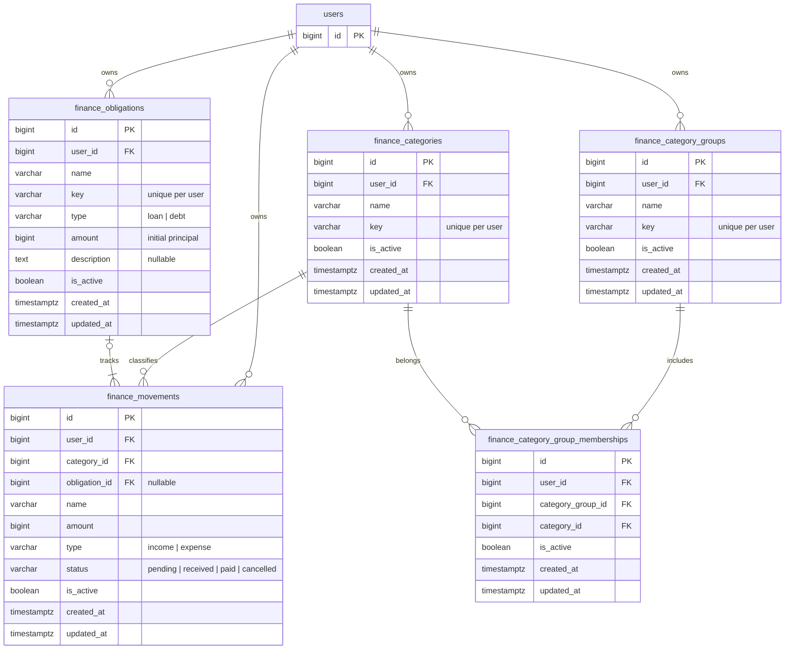

# Finanzas personales — ERD propuesto

> Estado: en revisión — esquema técnico sin aprobación completa
> Fecha: 2026-10-04
> Dependencias: 20-personal-finance-interview.md, 03-domain-model-erd.md, ADR-011 propuesto

Las tablas/FKs están integradas en el documento 03 y en el diagrama Obsidian solicitado. Contratos y ejecución propuesta en [22](22-personal-finance-contracts.md), [23 Server](23-personal-finance-backend-plan.md) y [24 Client](24-personal-finance-client-plan.md); implementación Backend y migración verificadas en PostgreSQL aislado; BD configurada sin cambios.

## Alcance y diagrama

Cinco tablas nuevas y users existente. Pesos enteros sin moneda en el nombre del campo. La migración de este diagrama se ensayó en PostgreSQL aislado; no se aplicó a la BD configurada del usuario.



Cada obligación tiene un origen y cero o más pagos. Cada movimiento tiene cero o una obligación. La pivote también referencia users mediante user_id; se omite esa arista para reducir cruces visuales.

## Contratos propuestos

- IDs bigint autoincrementales siguiendo Core. Amount bigint positivo, pesos enteros. IDs/importes se serializan como strings decimales para preservar exactitud en JSON/TypeScript; definir límite de importe y aritmética exacta antes de implementar.
- Nombres/keys varchar(255); keys no vacías, estables y únicas por tabla/usuario. La key es técnica; relaciones por ID. Nombre personal no requiere traducción automática.
- Categoría requerida; obligación opcional. Descripción de obligación opcional. Sin campo de propósito ni motivo obligatorio de anulación.
- created_at/updated_at de servidor, timestamptz. Reportes propuestos por creación, con zona de visualización a concretar; updated_at no se usa como fecha de liquidación. No hay occurred_on ni fecha de vencimiento.
- is_active archiva; no invalida importes confirmados. Cancelled es la anulación financiera, conservando el registro. Archivar una categoría/obligación no altera cálculos históricos; no se selecciona para nuevas operaciones.

## Estados y liquidación

| Tipo | Estados permitidos | Afecta caja |
|---|---|---|
| income | pending, received, cancelled | Solo received |
| expense | pending, paid, cancelled | Solo paid |

| Obligación | Movimiento inicial | Movimientos que liquidan |
|---|---|---|
| loan | expense | income confirmados |
| debt | income | expense confirmados |

Sin obligación, el movimiento es ordinario. Con obligación, su dirección y el tipo loan/debt bastan para distinguir el inicial de sus pagos en este alcance sin intereses ni nuevos desembolsos. No hace falta purpose.

Propuesta de estados: pending → confirmado/cancelled; confirmado → cancelled; cancelled terminal. Conservar el registro anulado; no exigir un motivo. Una anulación no debe generar además un inverso si se excluye el original del cálculo.

## Monto inicial y saldo

finance_obligations.amount almacena el monto inicial, según decisión explícita del usuario. No decrementar ese campo con cada pago. finance_movements.amount representa el importe individual que entró o salió; son conceptos distintos aunque el movimiento inicial coincida con el monto de la obligación.

```text
loan.remaining_amount = obligation.amount - SUM(income received vinculados)
debt.remaining_amount = obligation.amount - SUM(expense paid vinculados)
```

remaining_amount es calculado, no otra columna editable. El movimiento inicial afecta caja y no se resta como pago. Pending/cancelled no liquidan. Saldo cero significa obligación liquidada.

Ejemplo: loan.amount = 100.000, expense inicial = 100.000 e income confirmados de 20.000 + 20.000: saldo pendiente = 60.000. El amount de la obligación sigue en 100.000.

Propuesta: crear obligación y movimiento inicial de igual importe en una transacción. No admitir más de un desembolso inicial por obligación. Al editar amount de obligación, actualizar también el inicial dentro de la misma transacción y no bajar de lo liquidado. Cancelar el origen requiere revisar sus pagos vigentes; las fórmulas anteriores aplican a obligaciones vigentes. Detalle en contrato 22, sin agregar campos de dominio.

## Integridad e índices previstos

1. user_id NOT NULL con FK a users en todas las tablas. Contexto propietario derivado de sesión.
2. UNIQUE(user_id, id) en categorías, grupos y obligaciones para FKs compuestas. Movimientos referencian categoría/obligación por (user_id, ID); pivote referencia grupo/categoría del mismo propietario.
3. UNIQUE(user_id, key) por mantenedor y UNIQUE(user_id, category_group_id, category_id) en la pivote. Reactivar una asociación en vez de duplicarla.
4. CHECK amount > 0 en movimientos y obligaciones; tipos/estados permitidos y coherencia tipo/estado.
5. Creación inicial coherente con tipo e importe de obligación; validar la operación completa en el caso de uso transaccional. No usar índices sobre campos eliminados ni asumir que un CHECK de una fila valida las relaciones de importes.
6. FKs ON DELETE NO ACTION para conservar historia; no borrados físicos/cascadas de registros vinculados.
7. Índices iniciales de movimientos: (user_id, created_at DESC, id DESC), (user_id, category_id, created_at DESC, id DESC), y (user_id, obligation_id, type, status) para obligación no nula. Pivote: (user_id, category_id, category_group_id), complementando el único que comienza por grupo. Validar planes reales al implementar.
8. Confirmar/anular origen o pagos bajo lock de obligación; recalcular con lecturas frescas dentro de la transacción. Propuesta: rechazar sobrepagos y anulación del origen con pagos confirmados vigentes. Pending no reserva saldo; validar de nuevo al confirmar. Todos los escritores deben conservar esas garantías.
9. Filtrar grupos sin multiplicar movimientos. Totales de grupos distintos pueden solaparse; no sumarlos para obtener total general. Cambios de pertenencia afectan filtros históricos; no cambian la categoría del movimiento.

## Implementación y pendientes operativos

Idempotencia de altas/confirmaciones: clave por usuario/intención, reserva atómica, hash del comando y respuesta recuperable; su almacenamiento técnico no está incluido en este ERD de dominio. No confundir clave de petición con ID del movimiento.

Verificación ejecutada: casos de uso y HTTP real con principal sintético para ámbito, estados, pagos parciales, grupos sin duplicación, archivado y anulación. PostgreSQL 16 aislado confirmó FKs/constraints, metadata, up/down/up, rollback, carreras de pagos/confirmación/anulación y respaldo/restauración. Evidencia reproducible en plan 23.

Dominio, navegación, DTOs/contratos y traducciones de sistema reconciliados con la implementación local. Quedan aplicar migración/seed a la BD objetivo y desarrollar Client; ningún documento se aprobó automáticamente. Recurrencias, intereses, transferencias/cuentas y saldos heredados no están definidos.
