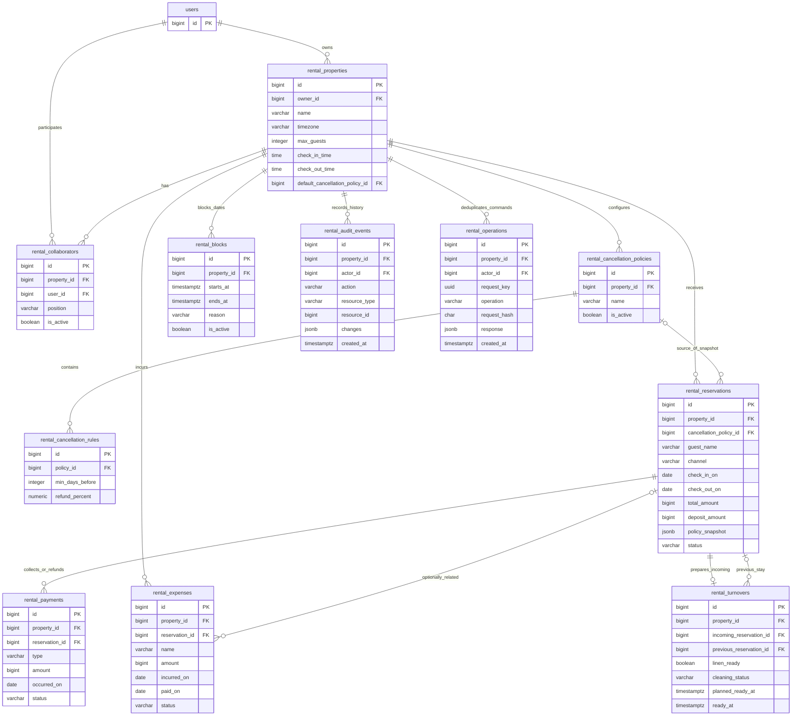

# Reservas — ERD aceptado

> Estado: aprobado — esquema aceptado explícitamente por el usuario el 2026-10-04; Backend implementado; migración objetivo pendiente
> Fecha: 2026-10-04
> Dependencias: [entrevista 25](25-rental-reservations-interview.md), [especificación 26](26-rental-reservations-spec.md), [ADR-012 propuesto](../architecture/decisions/ADR-012-rental-property-collaboration.md)

## Alcance de esta entrega

El usuario solicita seguir la secuencia de Finanzas: primero mostrar el diagrama; si lo acepta, incorporarlo al JSON de Obsidian y reconciliar documentación; después preparar el plan Backend y luego el plan Client para desarrollo con múltiples agentes.

El esquema aceptado contiene **nueve tablas de dominio y dos técnicas**, reutilizando `users`. Se incorporó al documento 03 y al JSON de Obsidian tras la aprobación explícita. Los contratos 28 y el plan Backend 29 se preparan para desarrollo con múltiples agentes; el plan Client viene después. Backend implementó once entidades, migración incremental y 44 operaciones; schema/seed/HTTP/concurrencia se verificaron en PostgreSQL temporal. La BD configurada no se modificó; evidencia y aplicación operativa en 29.

El JSON se actualizó en `C:\Users\Oscar\Documents\Obsidian Vault\obsidian-notes\Diagramas DB\nodia.json`, conservando todos los objetos anteriores. Respaldo exacto: `nodia.before-rentals-2026-10-04T20-48-21-208Z.json.bak` en la misma carpeta.

## Tablas y propósito

| Tabla | Propósito |
|---|---|
| `rental_properties` | Casa, propietario, capacidad, zona horaria, horarios y valores habituales |
| `rental_collaborators` | Usuarios agregados para administrar una casa |
| `rental_cancellation_policies` | Políticas de cancelación de reservas directas configuradas por casa |
| `rental_cancellation_rules` | Tramos: anticipación mínima y porcentaje a devolver |
| `rental_reservations` | Huésped, estadía, precio/abono acordados, estado y condiciones conservadas |
| `rental_payments` | Pagos y devoluciones efectivamente registrados, con fecha real |
| `rental_expenses` | Gastos opcionales de la casa; reserva relacionada opcional |
| `rental_blocks` | Períodos bloqueados por uso propio, mantenimiento o preparación |
| `rental_turnovers` | Preparación para la próxima entrada: recambio, limpieza y planificación |
| `rental_audit_events` | Historia de cambios y usuario responsable |
| `rental_operations` | Recuperar escrituras repetidas sin duplicar sus efectos |

No se propone otra tabla de huéspedes para esta primera versión: nombre/contacto se conservan en la reserva. Tampoco hay inventario de ropa, cuentas bancarias, categorías mantenidas aparte ni integración con Finanzas personales.

## Diagrama de relaciones



La vista resume campos y omite aristas repetidas de casa/autoría para facilitar lectura. `rental_properties.default_cancellation_policy_id` es opcional y referencia una política de la misma casa; su arista inversa no se dibuja para evitar un ciclo visual. DBML siguiente contiene todos los campos y FKs. `property_id` en registros dependientes permite proteger pertenencia mediante FKs compuestas, no mantener copias personales.

## DBML completo — fuente del esquema aceptado

```dbml
Project rental_reservations {
  database_type: 'PostgreSQL'
  Note: 'Esquema aceptado; SQL y migración pendientes de implementación.'
}

// Solo referencia a la tabla existente; no volver a crear users.
Table users {
  id bigint [pk]
}

Table rental_properties {
  id bigint [pk, increment, not null]
  owner_id bigint [not null]
  name varchar(255) [not null]
  location varchar(500)
  timezone varchar(64) [not null]
  max_guests integer [not null]
  check_in_time time [not null]
  check_out_time time [not null]
  default_nightly_rate bigint
  default_deposit_percent numeric(5,2)
  minimum_turnover_minutes integer [not null, default: 0]
  default_cancellation_policy_id bigint
  notes text
  is_active boolean [not null, default: true]
  created_by bigint [not null]
  updated_by bigint [not null]
  created_at timestamptz [not null]
  updated_at timestamptz [not null]
  indexes {
    owner_id [name: 'idx_rental_properties_owner']
  }
}

Table rental_collaborators {
  id bigint [pk, increment, not null]
  property_id bigint [not null]
  user_id bigint [not null]
  position varchar(255)
  is_active boolean [not null, default: true]
  created_by bigint [not null]
  updated_by bigint [not null]
  created_at timestamptz [not null]
  updated_at timestamptz [not null]
  indexes {
    (property_id, user_id) [unique, name: 'uq_rental_collaborator']
    (user_id, is_active, property_id) [name: 'idx_rental_collaborator_access']
  }
}

Table rental_cancellation_policies {
  id bigint [pk, increment, not null]
  property_id bigint [not null]
  name varchar(255) [not null]
  is_active boolean [not null, default: true]
  created_by bigint [not null]
  updated_by bigint [not null]
  created_at timestamptz [not null]
  updated_at timestamptz [not null]
  indexes {
    (property_id, id) [unique, name: 'uq_rental_policy_property_id']
    (property_id, is_active, id) [name: 'idx_rental_policy_listing']
  }
}

Table rental_cancellation_rules {
  id bigint [pk, increment, not null]
  policy_id bigint [not null]
  min_days_before integer [not null]
  refund_percent numeric(5,2) [not null]
  created_by bigint [not null]
  updated_by bigint [not null]
  created_at timestamptz [not null]
  updated_at timestamptz [not null]
  indexes {
    (policy_id, min_days_before) [unique, name: 'uq_rental_policy_threshold']
  }
}

Table rental_reservations {
  id bigint [pk, increment, not null]
  property_id bigint [not null]
  guest_name varchar(255) [not null]
  guest_contact varchar(255) [not null]
  guests_count integer [not null]
  channel varchar(32) [not null, note: 'whatsapp | airbnb | facebook | other']
  external_reference varchar(255)
  check_in_on date [not null]
  check_out_on date [not null]
  check_in_time time [not null]
  check_out_time time [not null]
  nightly_rate bigint [not null]
  cleaning_fee bigint [not null, default: 0]
  discount_amount bigint [not null, default: 0]
  total_amount bigint [not null]
  commission_amount bigint [not null, default: 0]
  deposit_amount bigint [not null]
  deposit_due_at timestamptz
  balance_due_at timestamptz
  cancellation_policy_id bigint
  policy_snapshot jsonb
  status varchar(32) [not null, note: 'draft | confirmed | in_progress | completed | cancelled']
  cancelled_at timestamptz
  refund_amount bigint
  cancellation_snapshot jsonb
  notes text
  is_active boolean [not null, default: true]
  created_by bigint [not null]
  updated_by bigint [not null]
  created_at timestamptz [not null]
  updated_at timestamptz [not null]
  indexes {
    (property_id, id) [unique, name: 'uq_rental_reservation_property_id']
    (property_id, check_in_on, id) [name: 'idx_rental_reservation_calendar']
    (property_id, status, check_in_on, id) [name: 'idx_rental_reservation_status']
    (property_id, channel, external_reference) [unique, name: 'uq_rental_reservation_external_reference']
  }
}

Table rental_payments {
  id bigint [pk, increment, not null]
  property_id bigint [not null]
  reservation_id bigint [not null]
  type varchar(16) [not null, note: 'payment | refund']
  amount bigint [not null]
  occurred_on date [not null]
  method varchar(100)
  reference varchar(255)
  notes text
  status varchar(16) [not null, note: 'confirmed | voided']
  created_by bigint [not null]
  updated_by bigint [not null]
  created_at timestamptz [not null]
  updated_at timestamptz [not null]
  indexes {
    (property_id, reservation_id, type, status) [name: 'idx_rental_payment_balance']
    (property_id, occurred_on, id) [name: 'idx_rental_payment_cash']
  }
}

Table rental_expenses {
  id bigint [pk, increment, not null]
  property_id bigint [not null]
  reservation_id bigint
  name varchar(255) [not null]
  category varchar(100)
  amount bigint [not null]
  incurred_on date [not null]
  paid_on date
  status varchar(16) [not null, note: 'pending | paid | voided']
  notes text
  created_by bigint [not null]
  updated_by bigint [not null]
  created_at timestamptz [not null]
  updated_at timestamptz [not null]
  indexes {
    (property_id, incurred_on, id) [name: 'idx_rental_expense_listing']
    (property_id, status, paid_on, id) [name: 'idx_rental_expense_cash']
    (property_id, reservation_id) [name: 'idx_rental_expense_reservation']
  }
}

Table rental_blocks {
  id bigint [pk, increment, not null]
  property_id bigint [not null]
  starts_at timestamptz [not null]
  ends_at timestamptz [not null]
  reason varchar(255) [not null]
  notes text
  is_active boolean [not null, default: true]
  created_by bigint [not null]
  updated_by bigint [not null]
  created_at timestamptz [not null]
  updated_at timestamptz [not null]
  indexes {
    (property_id, is_active, starts_at, id) [name: 'idx_rental_block_calendar']
  }
}

Table rental_turnovers {
  id bigint [pk, increment, not null]
  property_id bigint [not null]
  incoming_reservation_id bigint [not null]
  previous_reservation_id bigint
  linen_ready boolean [note: 'null = por confirmar; true = recambio completo disponible']
  cleaning_status varchar(16) [not null, note: 'pending | in_progress | completed']
  planned_ready_at timestamptz
  ready_at timestamptz
  same_day_approved_at timestamptz
  notes text
  created_by bigint [not null]
  updated_by bigint [not null]
  created_at timestamptz [not null]
  updated_at timestamptz [not null]
  indexes {
    incoming_reservation_id [unique, name: 'uq_rental_turnover_incoming']
    (property_id, planned_ready_at, id) [name: 'idx_rental_turnover_listing']
    (property_id, previous_reservation_id) [name: 'idx_rental_turnover_previous']
  }
}

Table rental_audit_events {
  id bigint [pk, increment, not null]
  property_id bigint [not null]
  actor_id bigint [not null]
  action varchar(100) [not null]
  resource_type varchar(64) [not null]
  resource_id bigint [not null]
  changes jsonb [not null]
  created_at timestamptz [not null]
  indexes {
    (property_id, created_at, id) [name: 'idx_rental_audit_history']
    (property_id, resource_type, resource_id, id) [name: 'idx_rental_audit_resource']
  }
}

Table rental_operations {
  id bigint [pk, increment, not null]
  property_id bigint [not null]
  actor_id bigint [not null]
  request_key uuid [not null]
  operation varchar(100) [not null]
  request_hash char(64) [not null]
  response jsonb [not null]
  created_at timestamptz [not null]
  indexes {
    (property_id, actor_id, request_key) [unique, name: 'uq_rental_operation_request']
  }
}

Ref: rental_properties.owner_id > users.id [delete: restrict]
Ref: rental_properties.created_by > users.id [delete: restrict]
Ref: rental_properties.updated_by > users.id [delete: restrict]
Ref: rental_properties.(id, default_cancellation_policy_id) > rental_cancellation_policies.(property_id, id) [delete: restrict]

Ref: rental_collaborators.property_id > rental_properties.id [delete: restrict]
Ref: rental_collaborators.user_id > users.id [delete: restrict]
Ref: rental_collaborators.created_by > users.id [delete: restrict]
Ref: rental_collaborators.updated_by > users.id [delete: restrict]

Ref: rental_cancellation_policies.property_id > rental_properties.id [delete: restrict]
Ref: rental_cancellation_policies.created_by > users.id [delete: restrict]
Ref: rental_cancellation_policies.updated_by > users.id [delete: restrict]
Ref: rental_cancellation_rules.policy_id > rental_cancellation_policies.id [delete: restrict]
Ref: rental_cancellation_rules.created_by > users.id [delete: restrict]
Ref: rental_cancellation_rules.updated_by > users.id [delete: restrict]

Ref: rental_reservations.property_id > rental_properties.id [delete: restrict]
Ref: rental_reservations.(property_id, cancellation_policy_id) > rental_cancellation_policies.(property_id, id) [delete: restrict]
Ref: rental_reservations.created_by > users.id [delete: restrict]
Ref: rental_reservations.updated_by > users.id [delete: restrict]

Ref: rental_payments.property_id > rental_properties.id [delete: restrict]
Ref: rental_payments.(property_id, reservation_id) > rental_reservations.(property_id, id) [delete: restrict]
Ref: rental_payments.created_by > users.id [delete: restrict]
Ref: rental_payments.updated_by > users.id [delete: restrict]

Ref: rental_expenses.property_id > rental_properties.id [delete: restrict]
Ref: rental_expenses.(property_id, reservation_id) > rental_reservations.(property_id, id) [delete: restrict]
Ref: rental_expenses.created_by > users.id [delete: restrict]
Ref: rental_expenses.updated_by > users.id [delete: restrict]

Ref: rental_blocks.property_id > rental_properties.id [delete: restrict]
Ref: rental_blocks.created_by > users.id [delete: restrict]
Ref: rental_blocks.updated_by > users.id [delete: restrict]

Ref: rental_turnovers.property_id > rental_properties.id [delete: restrict]
Ref: rental_turnovers.(property_id, incoming_reservation_id) > rental_reservations.(property_id, id) [delete: restrict]
Ref: rental_turnovers.(property_id, previous_reservation_id) > rental_reservations.(property_id, id) [delete: restrict]
Ref: rental_turnovers.created_by > users.id [delete: restrict]
Ref: rental_turnovers.updated_by > users.id [delete: restrict]

Ref: rental_audit_events.property_id > rental_properties.id [delete: restrict]
Ref: rental_audit_events.actor_id > users.id [delete: restrict]
Ref: rental_operations.property_id > rental_properties.id [delete: restrict]
Ref: rental_operations.actor_id > users.id [delete: restrict]
```

## Semántica que acompaña al diagrama

### Identidad, acceso y autoría

- PKs nuevas `bigint` autoincrementales, IDs y montos serializados como strings decimales exactos. `request_key` es una clave de petición UUID, no un cambio de tipo de PK.
- `owner_id` solo en la casa. `property_id` delimita el ámbito de los demás registros; creador/colaborador no recibe una copia personal.
- `created_by`/`updated_by` se derivan de sesión validada, no del body. FKs a `users`; no FK a la pertenencia, para conservar autoría cuando se retire un colaborador.
- Propietario administra miembros/configuración; colaborador activo opera reservas/pagos/gastos/preparación. Esta matriz se incorporó al esquema aceptado, sin copiar `action_ids` ni privilegios globales de Business.
- Sin borrado físico de historia ni cascadas. Reactivar pertenencia existente, no duplicar `(property_id, user_id)`. Evitar añadir al propietario como su propio colaborador mediante caso de uso.
- Las dos tablas técnicas son internas; no necesitan CRUD público ni un tab en la aplicación. La auditoría permite saber qué cambió; la idempotencia evita repetir una escritura con la misma intención. Cumplen funciones distintas.

### Fechas y disponibilidad

- `check_in_on`/`check_out_on` son fechas civiles; noches = diferencia de fechas. Horas de cada reserva son el acuerdo conservado, distinto de los valores habituales de la casa.
- Validar zona IANA y horas locales inexistentes/ambiguas al convertir intervalos. Modelo aceptado: zona de la casa inmutable una vez tenga reservas/bloqueos, para no reinterpretar historia. Corregir una zona histórica exigiría una operación específica, fuera de edición ordinaria.
- Reserva ocupa `[entrada, salida)` cuando está confirmed/in_progress/completed; draft/cancelled no bloquean. Completed conserva ocupación histórica. `is_active = false` solo archiva una reserva: no libera sus noches ni borra pagos.
- Bloqueo activo ocupa `[starts_at, ends_at)`. Desactivarlo libera su período; no afecta dinero.
- Permitir una salida y nueva entrada el mismo día exige horas compatibles, intervalo mínimo de preparación y plan aprobado para esa transición. `minimum_turnover_minutes = 0` no constituye aprobación automática ni garantiza recambio.
- `previous_reservation_id` debe ser la salida anterior pertinente de la misma casa, no un ID arbitrario. Al modificar fechas/estado/bloqueos, recalcular vecinos e invalidar/revisar el plan si cambia la transición. `ready_at` describe preparación realizada; `planned_ready_at` no sustituye el hecho real.
- Diseño aceptado de concurrencia: bloquear la fila de la casa en una transacción antes de verificar/escribir disponibilidad en **ambas tablas**, reservas y bloqueos, y releer tras adquirir el lock. Bloquear únicamente reservas existentes falla cuando todavía no hay filas que bloquear. Ver [ADR-013 propuesto](../architecture/decisions/ADR-013-rental-integrity-and-idempotency.md).
- Las FKs y el lock no equivalen a una constraint declarativa de no solapamiento entre tablas. Se exige un único protocolo para todos los escritores y pruebas reales; un escritor SQL que lo omita puede romper la invariante. Implementado y demostrado para escritores de Nodia en PostgreSQL aislado según 29; no aplicado a la BD objetivo.

### Precio, abono y dinero

- `nightly_rate` se acuerda por reserva. Proponer un precio uniforme por noche dentro de la estadía; tarifas distintas por cada noche no están confirmadas y requerirían detalle adicional.
- `total_amount` conserva el monto acordado: noches × nightly_rate + cleaning_fee − discount_amount. Validar fórmula e importes en Server/BD con aritmética exacta; no sobrescribirlo al recibir un pago.
- `deposit_amount` guarda el abono exigido en CLP. La UI puede convertir un porcentaje, con redondeo hacia arriba al peso para no exigir fracciones; porcentaje habitual opcional en la casa. La equivalencia es un acuerdo, no una fórmula que cambie al modificar configuración.
- `commission_amount` representa comisión del anfitrión descontada por el canal; `expected_amount = total_amount − commission_amount` se calcula, no es otra columna editable. No incluir cargos exclusivos del huésped como si fueran ingresos del anfitrión.
- Para reservas directas, comisión cero salvo un cargo real definido y deposit_amount > 0 para confirmar. Para Airbnb, deposit_amount = 0 porque no se exige abono externo; confirmación de plataforma independiente de cobro recibido. Cambiar importes/fechas de una reserva con dinero requiere comando específico, auditado y revisión del acuerdo.
- `rental_payments` solo contiene dinero efectivamente recibido/devuelto. `type = payment` suma a caja; `refund` resta. `status = voided` corrige un registro erróneo; no representa devolución bancaria ni debe utilizarse para deshacer un cobro real.
- Pagos recibidos y devoluciones se suman por reserva; no almacenar `paid_amount` ni `remaining_amount` editables. Antes de cancelación, pendiente = expected_amount − pagos confirmados, sin permitir sobrepagos; devoluciones ordinarias tras cambios de precio quedan fuera del flujo automático inicial y requieren contrato antes de habilitarse.
- Cancelar conserva `refund_amount` como monto **aprobado a devolver**. No es dinero ya devuelto. Pendiente de devolución = refund_amount − SUM(refund confirmados). No exceder el monto aprobado ni los pagos reales. Crear/refund/anular se protege con lock de reserva y las mismas reglas ante concurrencia.
- Los pagos netos recibidos desde Airbnb afectan caja una sola vez. No registrar también su comisión como gasto pagado si ya se descontó del neto.
- `occurred_on` es fecha efectiva del cobro/devolución; no sustituirla por created_at. Gastos pagados usan `paid_on`, distinto de `incurred_on`. Categoría de gasto es texto opcional, sin mantenedor independiente en este alcance.
- Resultado de caja del período: pagos confirmados − devoluciones confirmadas − gastos pagados; filtrar por sus fechas efectivas y casa. No denominarlo utilidad contable completa.

### Política configurable y cancelación

- Cada política pertenece a una casa. Las reglas ordenadas por `min_days_before` definen tramos sin campos máximos duplicados: elegir el mayor mínimo que no exceda la anticipación. Exigir una regla de mínimo 0 en cada política utilizable para cubrir cancelaciones previas a la entrada.
- Modelo aceptado: **días calendario locales hasta la fecha de entrada** y devolución como porcentaje de dinero efectivamente pagado. Estos criterios se presentaron como propuestas en el ERD y quedaron incluidos en su aceptación explícita. Días y porcentajes concretos continúan configurables, sin defaults 14/7/0 impuestos.
- `policy_snapshot` conserva versión de estructura, base de cálculo, semántica de días y reglas acordadas al confirmar. La FK apunta al origen de configuración; cálculos de reservas confirmadas usan el snapshot. Editar/inactivar la política no altera acuerdos anteriores.
- `cancelled_at` es momento efectivo del aviso, no de captura. `cancellation_snapshot` conserva anticipación/tramo/pagos considerados y cálculo aprobado; `refund_amount` es su resultado en CLP. Redondeo de devolución hacia abajo al peso, sin exceder lo pagado, incluido en el modelo aceptado.
- Reservas Airbnb conservan condiciones/referencia de plataforma en un snapshot validado, sin aplicar las reglas directas. Registrar manualmente su resolución monetaria real; no asumir que todo el neto pagado o la comisión se devuelve.
- Cancelación antes de entrada cubierta por tramos. No presentación, cancelación del anfitrión y salida anticipada no usan silenciosamente el tramo de cero días: necesitan resolución explícita y contrato antes de habilitar cálculo automático.
- No crear políticas sin reglas completas para confirmar una reserva directa. Crear casa con política por defecto nula, configurar política/reglas y asignarla después en una transacción coherente; la FK circular opcional no obliga a insertar referencias inexistentes.

## Constraints y garantías que deberá implementar la migración

DBML representa columnas/índices/FKs; los checks especificados aquí se concretaron en la migración incremental y se verificaron en PostgreSQL aislado. No se afirma que el diagrama por sí solo las ejecute.

1. max_guests > 0; minimum_turnover_minutes >= 0; tarifas no nulas > 0; porcentajes en [0,100]. Fecha de salida > fecha de entrada; guests_count > 0 y <= capacidad vigente de casa en caso de uso.
2. Montos positivos en pagos/gastos/nightly_rate; cargos/descuento/comisión/abono no negativos. total_amount > 0, descuento no elimina el total, comisión <= total y deposit_amount <= total; validar total con aritmética que no desborde bigint intermediario.
3. CHECK de valores permitidos para channel/status/type y coherencia de campos de cancelación. Reserva cancelled exige cancelled_at/refund_amount/cancellation_snapshot; demás estados no deben contener una cancelación confirmada.
4. FK de pagos/gastos/preparación y política por `(property_id, ID)`, respaldada por UNIQUE en tabla referenciada. Gastos sin reserva son válidos por nulabilidad de reservation_id.
5. `paid_on` requerido solo para gasto paid; pending/voided no afecta caja. Si se anula un gasto pagado erróneo, conservar fecha previa en auditoría y ajustar estado/fecha del registro de forma coherente; no representarlo como devolución real.
6. Umbrales de regla >= 0 y únicos por política. Existencia de regla 0, pertenencia/cobertura y snapshots válidos requieren caso de uso transaccional; un CHECK de una fila no valida otras filas.
7. Turnover entrante único; previous_reservation_id distinto del entrante; `ready_at` solo con linen_ready = true y limpieza completed. Plan mismo día debe referenciar condiciones vigentes y hora de preparación compatible con nueva entrada.
8. UNIQUE(property_id, channel, external_reference) permite referencias nulas; normalizar vacío a null. Para Airbnb, referencia externa requerida al confirmar para prevenir duplicado manual. No deduplicar huéspedes por nombre/contacto.
9. FKs RESTRICT; sin borrado físico en interfaz. Índices propuestos no sustituyen revisar planes/volumen; calendario por ventana acotada, listados paginados y agregados por conjuntos, sin N+1 de pagos por reserva.
10. Las reglas de dinero agregado, capacidad, revocación y disponibilidad necesitan transacciones/casos de uso reales. Mantener orden de locks casa → reserva → operación financiera cuando correspondan, evitando adquisición inversa y trabajo externo dentro de la transacción.

## Auditoría e idempotencia

- Auditoría append-only, sin updated_at porque los eventos no se editan. action/resource_type se validan con un contrato finito; resource_id es referencia tipada de auditoría y no tiene FK polimórfica. No es prueba de pertenencia para acceso.
- `changes` solo conserva campos permitidos del cambio, sin secretos ni volcado indiscriminado de contacto/notas de huéspedes. Datos de auditoría no se imprimen en logs públicos y se consultan con pertenencia a la casa.
- `rental_operations` no sustituye a auditoría. UNIQUE(property_id, actor_id, request_key); request_hash incluye operación y comando canónico. Misma clave/intención recupera resultado; misma clave con otro comando produce conflicto.
- Operación, efecto y respuesta pública mínima permitida se confirman **en la misma transacción**. Si falla, rollback completo; no persiste una falsa respuesta exitosa. No hay estado pending/job porque no se realizan efectos bancarios externos en este módulo.
- `response` conserva resultado acotado y validado, sin secretos ni copia de contactos. Revalidar pertenencia al recuperar una operación; un colaborador retirado no puede usar idempotencia para seguir leyendo.
- No limpiar claves monetarias con un TTL arbitrario: expirarlas permite duplicar efectos. Definir retención antes de agregar limpieza automática. Clave por intención no detecta que alguien envió manualmente dos pagos reales con claves distintas; la referencia/conciliación de operación es otro problema.

## Decisiones incluidas en la aceptación del diagrama

1. Nueve tablas de dominio y dos técnicas, con colaboradores operativos por casa.
2. Huésped conservado dentro de la reserva y preparación simple, sin inventario.
3. Políticas normalizadas con reglas + condiciones conservadas en cada reserva; días calendario y base sobre pagado.
4. Pagos/devoluciones en una tabla y gastos aparte; importes/fechas reales, autoría e historial.
5. Soporte persistente de reintentos y control de disponibilidad por transacción/lock de casa.

El usuario confirmó «si esta bien, implementemoslo en el json de obsidian y empecemos con el backend». Se actualizan JSON y documentos afectados y se preparan contratos/plan Backend con agentes de documentación. Continúa pendiente el plan Client, según la secuencia solicitada. Los contratos y planes completos conservan estado de revisión.

## Verificación de la preparación de esta entrega

Comprobación estructural ejecutada: 12 tablas contando `users` existente, 144 campos, 38 FKs con columnas/tipos compatibles, 22 nombres de índices sin duplicados y ocho enlaces locales entre este documento y ADR-013. Nuevos archivos en LF y sin whitespace sobrante. `git diff --check` correcto para cambios registrados por Git.

Actualización verificada del JSON: 37 tablas y 69 relaciones; 11 tablas/143 campos/38 FKs/22 índices añadidos. Comparación profunda confirma tablas, relaciones y propiedades generales anteriores intactas, salvo lastModified. Respaldo por bytes idéntico al original (SHA-256 `0b55873fdb807df469c731522ab0f8c20d4f8391d8e3da816aaea192bfea3b86`). SHA-256 del JSON resultante: `6f68f9d13c6cde5c423da1dcdca5e1609023e2e7c8a86fc048df146a41b1ee26`.

Los DBML de este documento y 03 se compilaron correctamente con @dbml/cli a SQL PostgreSQL en un directorio temporal fuera del repositorio. No se ejecutó ese SQL ni se creó una migración de producto. Compilar el modelo no demuestra constraints, concurrencia o acceso en PostgreSQL. No se renderizó Mermaid o el editor de Obsidian ni se compilaron entidades. Índices/checks y protocolo aceptados requieren pruebas reales al implementarlos.

Fundamentos consultados: [constraints de PostgreSQL](https://www.postgresql.org/docs/current/ddl-constraints.html), [locks de filas](https://www.postgresql.org/docs/current/explicit-locking.html), [tipos de fecha/hora](https://www.postgresql.org/docs/current/datatype-datetime.html). La elección concreta del modelo y protocolo es una propuesta de Nodia.

Validación documental de integración: 15 documentos y 153 enlaces locales válidos; seis ejemplos JSON válidos en 28; 34 tareas de 29 sin dependencias cíclicas; 44 operaciones HTTP sobre 31 paths únicos. Campos/índices/FKs de 27 y03 coinciden con el JSON de Obsidian. `git diff --check` correcto. Esta evidencia corresponde a diagramas y planificación, no pruebas de ejecución del módulo.

## Evidencia posterior de Backend — 2026-10-04

Las once entidades y migración incremental reproducen este esquema; TypeORM no detecta drift en PostgreSQL temporal. Se probó up/down/up, constraints, idempotencia/concurrencia y restauración sin alterar la BD configurada. Ver [entrega29](29-rental-reservations-backend-plan.md). La aprobación se mantiene sobre el mismo esquema; JSON de Obsidian conserva su hash después del desarrollo.
