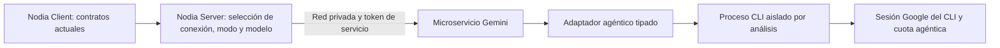

# 32 — Reemplazo del motor agéntico por Antigravity CLI

> Fecha: 2026-10-07
> Estado: implementación autorizada y operativa en Windows local; documento en revisión. Cierre de pantalla/operación Linux-VPS pendiente.
> Solicitud: reemplazar todas las operaciones agénticas actuales conservando el funcionamiento y los contratos del frontend.
> Continuidad: **AG-01/AG-12**, completar renovación/revocación y evidencias Linux-VPS; **AG-11**, extracción desde la pantalla del entorno destino.

## Resultado esperado

Una conexión Gemini con `use_token_plan_agentic` podrá consultar su estado, descubrir modelos, sincronizarlos, verificar su configuración y analizar facturas mediante la sesión Google del CLI oficial. Nodia Client seguirá consumiendo las mismas rutas, campos y opciones. El detalle del transporte quedará en el microservicio, detrás de Nodia Server.

El cierre exige una extracción real desde la pantalla de facturas, con el modelo elegido y datos revisables. Un `/health` positivo, un perfil existente o una lista de modelos no demuestran esa extracción.

Dependencias: [contrato de funcionalidades IA](ai-provider-feature-contract.md), [ADR-009](../architecture/decisions/ADR-009-truthful-gemini-engines.md), [ADR-015](../architecture/decisions/ADR-015-ai-api-provider-recovery.md), [ADR-016](../architecture/decisions/ADR-016-antigravity-cli-adapter.md) y [seguridad de microservicios](../architecture/internal-microservice-security.md). Esta propuesta no modifica las decisiones aprobadas de acceso privado ni el esquema vigente de conexiones IA.

## Diagnóstico confirmado antes del reemplazo

- `nodia-gemini-microservice/agentic_service.py` es un adaptador deshabilitado: `is_available()` devuelve `False`, no entrega modelos y el análisis lanza `agentic_unavailable`.
- FastAPI ya tiene `/agentic/status`, `/agentic/models` y `/agentic/analyze-invoice`. Las rutas genéricas también admiten la selección de motor. Podemos conservarlas y reemplazar su dependencia.
- NestJS concentra el transporte en `src/common/ai/gemini.service.ts`. Los casos de uso de salud, modelos, sincronización, verificación y análisis ya distinguen Web/Agentic.
- La normalización de estado en Server elimina actualmente las métricas agénticas. No se habilitarán cifras sin fuente comprobada.
- `/ready` comprueba actualmente Gemini Web. Su resultado no determina la disponibilidad agéntica.
- El login público `gemini-login/*` utiliza exclusivamente el login Web; el formulario no envía un motor. El CLI necesita una autenticación separada.
- El microservicio comparte una sesión por motor, no recibe una cuenta Google diferente por cada `ai_providers.id`. Las conexiones guardan configuraciones independientes sobre esa sesión compartida.

## Diseño del reemplazo

Mantener el microservicio existente. Separar el ejecutor de procesos del adaptador de negocio: el primero controla ejecución, streams, límites y cierre; el segundo interpreta estado/modelos y valida la extracción. Reutilizar el parser y contrato de facturas compartidos con Web. No crear un proxy genérico de comandos ni exponer la terminal al frontend.

Una sesión agéntica compartida será suficiente para esta entrega. Su perfil se administrará en el host del servicio y pertenecerá al usuario del proceso. Una instancia IA conserva su ID y sus opciones; crear varias conexiones no crea varias cuotas ni cuentas Google. Soporte multicuenta requeriría otro diseño.

## Puerta de viabilidad: antes del reemplazo

La documentación oficial describe autenticación Google, ejecución headless, selección de modelo/esfuerzo y salida estructurada. El canal de mensajes por stdin documentado admite texto; no demuestra transporte de imágenes o PDF. La prueba inicial debe resolver esa diferencia antes de comprometer el flujo de facturas. [Headless oficial](https://www.antigravity.google/docs/cli/headless/), [instalación y autenticación](https://www.antigravity.google/docs/cli/install/).

AG-01 debe producir evidencia de:

1. **Identidad y consumo:** login de la cuenta con su plan agéntico, sin activar el modo API del CLI ni consumo adicional facturado. Registrar versión y método, nunca tokens.
2. **Estado sin generar:** identificar una fuente soportada que compruebe autenticación sin enviar un prompt. Si no existe, documentar el impedimento; no sustituirlo por una inferencia periódica ni por la presencia de archivos.
3. **Descubrimiento:** comprobar la salida real de `agy models`, su formato y procedencia. Distinguir catálogo del CLI, modelos de la cuenta y elegibilidad de ejecución; una lista global no prueba acceso de la suscripción.
4. **Documento:** extraer un PDF y una imagen de prueba con contenido conocido. Comprobar lectura efectiva del archivo, no una respuesta genérica. Determinar un transporte multimodal compatible o herramientas de lectura seguras; no presentar texto obtenido a medias como soporte OCR completo.
5. **Modelo y esfuerzo:** ejecutar con ID descubierto exacto y opciones Low/Medium/High cuando sean aceptadas. Modelo u opción rechazados deben producir error; ninguna sustitución automática.
6. **Aislamiento:** probar que el agente no puede leer el repositorio, `.env`, otros documentos, perfiles Web ni secretos del host, y que no dispone de shell o herramientas innecesarias. Verificar el mecanismo real en Windows y Linux antes de declarar compatible cada entorno.
7. **Salida:** validar JSON estructurado contra el contrato de factura existente, incluyendo ceros y datos ausentes.
8. **Sesión operativa:** reiniciar el servicio, renovar credenciales según el mecanismo oficial, revocar la sesión y comprobar recuperación o necesidad de nuevo login.

Si falla una capacidad necesaria, **no habilitar Agentic en producción**. Documentar el resultado y revisar el diseño; evitar construir una integración que solo funcione para prompts de texto o que finja estado autenticado.

## Rutas y contratos que deben quedar cubiertos

Las rutas públicas conservan también sus aliases singular/plural existentes. La siguiente tabla identifica el cambio interno; no propone renombrarlas.

| Entrada actual | Ejecución propuesta | Garantía |
|---|---|---|
| `GET /ai-providers/health`, `/health-check`, `/verify-all` | Caso de uso → estado agéntico observado por el adaptador | Sin generar contenido; comprobación por sesión compartida, no una llamada externa por conexión. |
| `GET /ai-providers/gemini-engines`, `/gemini/engines` | `GET /engines/status` | Mantener normalización; Web caído no impide devolver estado Agentic, y viceversa. |
| `GET /ai-providers/models`, `/selectable-models` con modo agéntico | `GET /agentic/models` | IDs dinámicos y procedencia comprobada; configuración histórica no sustituye descubrimiento. |
| `POST /ai-providers/:id/sync-models` con modo agéntico | Descubrimiento CLI → caso de uso actual | `persist=false` no escribe; `persist=true` actualiza solo `fields.token_plan_agentic`; no selecciona el primer modelo. |
| `GET /invoices/verify-ia-providers`, `/verify-ia-provider` | Verificación de conexión, sesión y modelo mediante el mismo adaptador | `can_use_model` representa elegibilidad comprobada, no una inferencia realizada. |
| `POST /invoices/analyze` con modo agéntico | Caso de uso → cliente Gemini → `POST /agentic/analyze-invoice` → CLI | Misma respuesta de borrador; respetar conexión, modelo y esfuerzo. Incluye el flujo de facturas desde Negocios. |
| `GET /agentic/status` interno | Estado del transporte y sesión | Mantener `available`, `has_active_session`, `models`, `reason` y nulos reales. |
| `GET /agentic/models` interno | Catálogo descubierto y autenticación observada | Respuesta tipada; evitar `authenticated=true` derivado solo de configuración. |
| `POST /analyze-invoice` interno con `engine=agentic` | Mismo adaptador que la ruta explícita | Compatibilidad; rechazar discrepancia entre motor de ruta y cuerpo. |
| `GET /health` interno | Vida del proceso | Mantener respuesta mínima y sin token; no consultar Google. |
| `GET /ready` interno | Semántica Web actual conservada | Añadir `/agentic/ready` privado para preparación agéntica; ajustar probes del despliegue según su finalidad. |
| Login/refresh y modelos/estado/análisis Web | Adaptador Web actual | Conservar su sesión y funcionamiento independientes. |

`GeminiService.verifyProvider`, `getModelsAndQuota`, `getDualEngineStatus` y `extractInvoiceData` deben converger en los contratos nuevos del adaptador. No dejar una rama antigua para health y otra diferente para análisis.

No cambiar CRUD de catálogo/conexiones, gestión de claves ni ejecución API de OpenAI/Gemini. No hacen parte del transporte agéntico. Tampoco se requieren migraciones, limpieza de datos ni cambios de `nodia.json` para esta sustitución.

## Autenticación y operación con frontend intacto

El primer login agéntico se realizará administrativamente mediante el CLI oficial, en el mismo entorno y usuario que ejecutará los análisis. El navegador puede estar en otro equipo si el mecanismo oficial lo admite; las credenciales deben quedar en el host del servicio. No asumir que iniciar sesión en el escritorio Windows autentica un contenedor Linux.

Después del login, las consultas actuales del frontend reflejan la sesión observada. El botón existente de inicio de sesión sigue gestionando **Gemini Web**. La ampliación expresamente solicitada el 2026-10-07 añade un botón **Agentic independiente**, con enlace/código OAuth remoto del CLI, ownership y cancelación. Esta ampliación conserva el transporte y contratos de análisis; ver [funcionalidad implementada](../features/ai-providers/gemini-agentic-authentication.md) y [ADR-017](../architecture/decisions/ADR-017-gemini-agentic-remote-login.md). Persistencia e intercambio OAuth con cuenta del VPS siguen pendientes.

Preparar un runbook de instalación con versión fijada, login, persistencia, renovación, revocación, cambio de cuenta y recuperación. Proteger almacenamiento y backups; no transportar credenciales en `fields`, tablas IA o respuestas HTTP. Si se mantiene el contenedor, comprobar almacenamiento de credenciales bajo el UID real del servicio y restauración tras recrearlo. La renovación debe invalidar la caché de estado/modelos anterior.

## Estado, modelos, cuotas y razonamiento

- Separar transporte instalado/compatible, autenticación observada, catálogo descubierto e inferencia exitosa. Conservar el contrato público y traducir esas evidencias a sus campos, con `reason` seguro cuando falte alguna.
- Estado y catálogo usarán consultas no generativas con timeout y caché corta acotada. Agrupar comprobaciones concurrentes de la misma sesión; invalidar tras login/revocación/cambio de cuenta. Una respuesta antigua no puede autenticar una sesión nueva.
- La elegibilidad de un modelo debe basarse en la fuente verificada en AG-01. Si solo hay catálogo global, no atribuirle disponibilidad de cuenta; resolver ese impedimento antes de habilitar verificaciones positivas.
- No deducir capacidades de nombres, ni asignar modelos de respaldo. Comprobar el modelo al analizar y propagar rechazo aunque estuviera descubierto antes.
- Aplicar `thinking_levels[id]`/`thinking_level` al esfuerzo del CLI según compatibilidad comprobada. Ausencia significa no forzar una preferencia; no asignar Medium automáticamente. `extended_thinking` sigue perteneciendo a Web.
- Se comprobó `/usage` headless JSON en 1.3.1: cero turnos/tokens, buckets con fracción restante, ventana y fecha. Validar el reporte y publicar `quota_source:agentic_cli`; respuesta ausente/inválida mantiene cuota nula. El uso de tokens de una respuesta no representa saldo ni cuota restante. [Consulta oficial de cuotas](https://www.antigravity.google/docs/cli/commands/usage).
- Si aparece una fuente compatible de cuota, incorporarla con motor, fecha, unidades y validación de valores. Mantener cinco horas/semanal separadas y conservar cero. No bloquear el análisis por cuota desconocida ni convertir desconocido en cuota disponible.

## Límites, errores y limpieza

Crear cada análisis con contexto independiente y directorio temporal aleatorio. Iniciar el binario validado mediante subprocess asíncrono sin shell, parámetros permitidos y entorno mínimo. No incluir contenido de factura o secretos en argumentos/logs. Definir el transporte privado del prompt según la prueba inicial.

El aislamiento debe aplicar permisos efectivos y políticas de herramientas comprobadas; cambiar únicamente el directorio de trabajo no protege el host. Los archivos de entrada serán de solo lectura y los outputs estarán acotados. No utilizar aprobación global de permisos. Impedir lectura de credenciales por herramientas sin impedir el mecanismo de autenticación del CLI.

Acotar admisión, número de procesos, tamaño de stdout/stderr, tiempo total y recursos. Mantener un worker; comenzar con un análisis agéntico simultáneo hasta medir compatibilidad del perfil y carga. El límite general de análisis del servicio se mantiene coordinado con el agéntico.

Revisar el presupuesto completo de upload → admisión → CLI → validación → respuesta. La incidencia del 2026-10-07 coordinó upload 30 s, análisis 300 s, CLI hasta 240 s, NestJS 340 s y frontend 360 s, con comprobaciones de análisis de hasta 25 s cada una. Estado mantiene caché 30 s y deadline 12 s. Eliminar el techo oculto agéntico de 105 s y el máximo de configuración de 75 s. Los plazos del proxy del despliegue destino aún deben verificarse; estos límites no garantizan respuesta del proveedor ni permiten esperas indefinidas.

Timeout, cancelación, desconexión y shutdown deben terminar y esperar el proceso y sus hijos propios, liberar semáforos y limpiar temporales en Windows/Linux. Limpiar también historial/artefactos de facturas que el CLI pueda persistir fuera del temporal. No reutilizar conversaciones entre documentos.

| Situación | Tratamiento previsto |
|---|---|
| Entrada, modo/modelo/esfuerzo incompatibles | Validación 400/422 según la frontera actual; sin ejecutar. |
| Binario ausente/incompatible o sesión requerida/revocada | Estado no operativo; análisis 503 con código y mensaje seguros. No usar 401 de Google como logout de la sesión Nodia. |
| Saturación local | Rechazo 503 acotado; no cola ilimitada. |
| Cuota agotada confirmada por proveedor | 429; `Retry-After` solo cuando exista una fuente válida. |
| Timeout del análisis | 504; resultado incierto explicitado, sin reejecución automática. |
| Fallo externo o salida inválida/incompleta | 502/503 según causa; no éxito vacío. |
| Cancelación | Limpieza y propagación; sin cambiar de motor/modelo. |

El exit code del CLI por sí solo no confirma lectura del archivo ni una extracción válida. Validar estado de la ejecución, errores estructurados y esquema del resultado. No repetir automáticamente una inferencia tras timeout, respuesta perdida o agotamiento: puede consumir cuota aunque no recibamos el resultado.

Registrar correlación, operación, versión, duración, categoría de fallo y resultado de validación. No registrar tokens, cookies, documentos, prompts, respuestas completas ni stderr bruto. Las rutas privadas siguen exigiendo el token de servicio; los permisos existentes de Nodia se conservan.

## Checklist de implementación en orden

AG-03..10 implementados y comprobados localmente. AG-01/02 conservan pendientes de cuenta/Linux, AG-11 de pantalla y AG-12 de operación destino. Los criterios siguientes no se cierran con mocks ni con evidencia Windows para Linux.

| ID | Trabajo y archivos principales | Dependencia | Criterio de cierre |
|---|---|---|---|
| AG-01 | PoC aislada del CLI y registro de evidencias sin secretos | — | Resolver los ocho puntos de viabilidad; documentar Windows/Linux por separado. |
| AG-02 | Fijar versión/instalación, configuración y perfil; `Dockerfile`, Compose, `.env.example`, README | AG-01 | Arranque reproducible y login bajo usuario real; no consumo API/overage. |
| AG-03 | Ejecutor acotado de procesos y política de archivos/herramientas | AG-01/02 | Timeout/cancelación/shutdown sin procesos ni archivos abandonados; aislamiento efectivo. |
| AG-04 | Reemplazar `agentic_service.py`; contratos en `schemas.py`; inicialización/cierre en `main.py` | AG-03 | Dependencia inyectable, import sin efectos operativos y estado observable. |
| AG-05 | Estado, descubrimiento, caché y readiness por motor | AG-04 | Todas las lecturas privadas tipadas; motor Web caído no oculta Agentic. |
| AG-06 | Análisis CLI, opciones, prompt/esquema y parser compartido | AG-04/05 | PDF/imagen → borrador válido; modelo/esfuerzo exactos y límites completos. |
| AG-07 | Cliente NestJS y normalización; `gemini.service.ts`, `gemini-engine-status.ts`, tipos compartidos | AG-05/06 | Consumir rutas agénticas explícitas; validar respuestas y errores sin alterar contratos públicos. |
| AG-08 | Salud/modelos/sync; casos de uso en `src/ai-provider/use-case/` | AG-07 | Una observación por sesión; modelos por conexión/modo; persistencia selectiva y sin selección implícita. |
| AG-09 | Verificación/análisis; casos de uso en `src/invoice/use-case/`, DTO/controlador solo donde corresponda | AG-07/08 | Validar comando final tras combinar body/query/configuración; analizar desde Facturas y Negocios sin alterar permisos. |
| AG-10 | Regresiones Python, casos de uso NestJS y HTTP compilado aislado | AG-04..09 | Cubrir matriz siguiente y aliases; ninguna llamada a cuentas reales en suites unitarias. |
| AG-11 | QA de contratos/frontend actual y reconciliación documental | AG-10 | Sin cambios de UI para transporte; preservar features recuperadas; actualizar contrato IA, ADR-009, instrucciones operativas y runbook. |
| AG-12 | Integración con sesión real, reinicio y despliegue escalonado | AG-11 | Criterios de entrega satisfechos en el entorno destino; rollback ensayado. |

## Matriz de verificación

| Área | Casos mínimos |
|---|---|
| Transporte/sesión | CLI ausente, incompatible, sin login, renovación, revocación, reinicio y perfil bloqueado. Estado GET sin prompts. |
| Modelos/opciones | Catálogo vacío/malformado/global, modelo histórico retirado, ID desconocido, Low/Medium/High admitido/rechazado, sin modelo ni preferencia; sin fallback. |
| Archivos y JSON | PDF, imagen, tamaño/tipo/firma inválidos, documento sin productos, JSON corrupto, números inválidos, ceros y nulos; límite de respuesta. |
| Recursos | Saturación, timeout, cancelación, proceso hijo, startup parcial y shutdown; temporales/historial limpios y cuota no repetida automáticamente. |
| Seguridad | Token interno ausente/incorrecto; permisos de usuario conservados; inyección en nombres/opciones; herramientas sin acceso a secretos/documentos ajenos. |
| Contratos y datos | Todos los aliases; status/modelos/sync/verify/analyze; `persist=false`, configuración histórica y campos de otros modos intactos. |
| UI existente | Sesión agéntica operativa e indisponible; sincronizar/seleccionar/guardar modelos; esfuerzo enviado; extracción revisable y error recuperable; API/Web conservados. |
| Cuotas | Desconocido, cero real, respuesta caducada/inválida y agotamiento confirmado; sin métricas Web atribuidas a Agentic. |

Python utiliza `run_tests.py` con aislamiento antes del discovery. NestJS mantiene pruebas unitarias exclusivamente en casos de uso y smoke HTTP compilado para la integración del transporte. Client conserva sus pruebas de componentes y QA aislado; respetar caché Vite por modo para no repetir la incidencia de importación dinámica. Ejecutar tipado/lint/build y suites pertinentes al implementar, ampliándolas cuando las fallas lo justifiquen.

## Entrega, activación y reversión

La entrega puede declararse operativa únicamente cuando:

- [ ] Cuenta real autenticada, origen agéntico confirmado y reinicio sin perder sesión.
- [ ] Salud, estado, descubrimiento, sincronización y verificación responden correctamente a través de NestJS.
- [ ] Desde el frontend actual se analiza al menos una imagen y un PDF conocidos; borrador revisable correcto y modelo solicitado respetado.
- [ ] Fallos de sesión/cuota/modelo/timeout se muestran sin éxito ficticio ni cambio de proveedor/motor.
- [ ] No se exponen secretos ni se permite al agente acceder a archivos ajenos al análisis.
- [ ] Web y API conservan funcionamiento; no se modificaron/borraron registros ni claves para activar Agentic.
- [ ] Entorno destino, versión y resultados quedan registrados; las pruebas locales no se presentan como evidencia del VPS.
- [ ] Rollback devuelve Agentic a indisponibilidad explícita sin sustituirlo por Web ni revertir otras funcionalidades IA.

Activar mediante configuración del adaptador solo después de estas comprobaciones. Mantener la revisión anterior del servicio disponible para rollback y conservar el perfil de forma protegida. La reversión no ejecutará migraciones destructivas ni restaurará configuraciones históricas que retiraban API keys o flags de modo.

El plan original no ejecutó operaciones. La implementación posterior autorizada se registra al final; no implica aprobación documental.

## Implementación comprobada — 2026-10-07

CLI oficial 1.3.1 instalado/verificado fuera del workspace; sesión Google reutilizada por el cliente oficial. `/usage` JSON cero turnos/tokens y catálogo dinámico de 14 IDs en esta observación; Low/Medium/High conservan los IDs correspondientes. PDF/PNG sintéticos correctos por adaptador y NestJS/FastAPI con Web caído y persistencia/auth Nodia en memoria. No confirma factura/stock ni acceso a todos los modelos.

Ejecutor acotado, un análisis, perfiles temporales, hook de lectura exacta y finalización estructurada, permisos sin shell/escritura/URL/MCP. Canarios Windows rechazados; handshake/Job Object evita la carrera del redirector `.venv`, grupos Linux y pruebas de cancelación/descendientes. No se afirma sandbox OS completo Windows. `useG1Credits:false` desactiva overage; sin modo API.

Health/modelos/sync/verify/analyze utilizan el mismo adaptador. Análisis interno explícito, catálogo validado, cuotas con procedencia/fecha, salud compartida y sincronización solo del scope solicitado. Opciones finales tras merge legacy validadas; IDs/esfuerzo conservados. Client mantiene UI/rutas y conserva features recuperadas. No se agrega un visor de cuotas agénticas.

Evidencia: Python 76 pruebas Windows/Linux; Server suite completa 651/100 y 156 focalizadas; Client 73/8. Build/lint y HTTP compilado correctos (dos avisos previos de lint). Servicios locales recargados; `/agentic/status`, `/agentic/models`, `/agentic/ready` y estado dual 200 con sesión activa, acceso sin token 401. `.env` preservado, cuatro variables CLI añadidas y valores anteriores guardados fuera de Git.

QA autenticada en Ajustes IA: listado y detalle cargan sin error de importación dinámica; Mi gemini informa sesión Agentic conectada y muestra Low/Medium/High. Su modelo agéntico permanece sin asignar y el catálogo de ese modo aún no está sincronizado; no se eligió un modelo por el usuario ni se modificó la BD en esta comprobación.

Pendientes reales: extracción desde pantalla del usuario, renovación/revocación prolongadas, sesión/canarios/restauración Linux-VPS y rollback de cuenta. Instalación/imagen/configuración están preparadas; el Compose base no activa Agentic y no se desplegó en VPS. Procedimientos y límites en [runbook](agentic-cli-runbook.md). Documento en revisión; ninguna aprobación automática.
